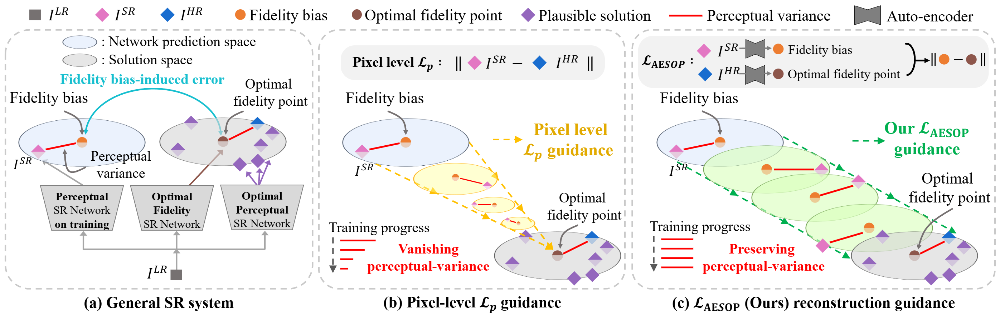
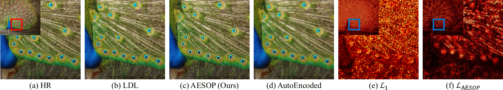
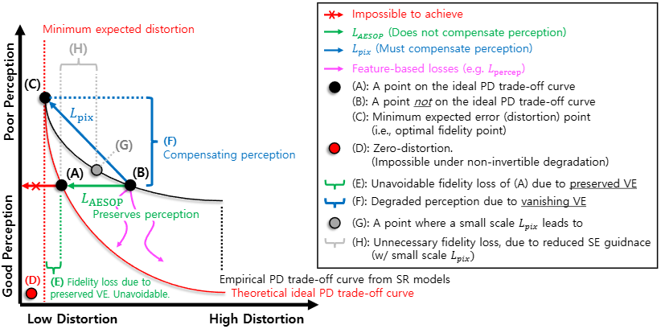
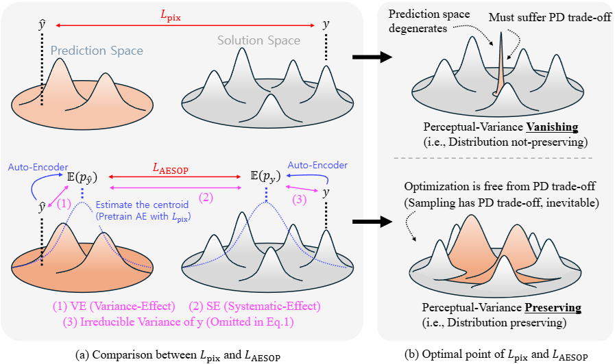

## [CVPR2025] AESOP 🦊🍇: Auto-Encoded Supervision for Perceptual Image Super-Resolution 
<a href="https://arxiv.org/abs/2412.00124"></a>
[](https://paperswithcode.com/sota/image-super-resolution-on-div2k-val-4x?p=auto-encoded-supervision-for-perceptual-image)

MinKyu Lee, Sangeek Hyun, Woojin Jun, Jae-Pil Heo*\
Sungkyunkwan University\
\*: Corresponding Author

This is the official Repository of: Auto-Encoded Supervision for Perceptual Image Super-Resolution\
⭐ If you find AESOP helpful, please consider giving this repository a star. Thanks! 🤗


> This work tackles the fidelity objective in the perceptual super-resolution (SR). Specifically, we address the shortcomings of pixel-level $L_\text{p}$ loss ($L_\text{pix}$) in the GAN-based SR framework. Since $L_\text{pix}$ is known to have a trade-off relationship against perceptual quality, prior methods often multiply a small scale factor or utilize low-pass filters. However, this work shows that these circumventions fail to address the fundamental factor that induces blurring. Accordingly, we focus on two points: 1) precisely discriminating the subcomponent of $L_\text{pix}$ that contributes to blurring, and 2) only guiding based on the factor that is free from this trade-off relationship. We show that they can be achieved in a surprisingly simple manner, with an Auto-Encoder (AE) pretrained with $L_\text{pix}$. Accordingly, we propose the Auto-Encoded Supervision for Optimal Penalization loss ($L_\text{AESOP}$), a novel loss function that measures distance in the AE space, instead of the raw pixel space. Note that the AE space indicates the space after the decoder, not the bottleneck. By simply substituting $L_\text{pix}$ with $L_\text{AESOP}$, we can provide effective reconstruction guidance without compromising perceptual quality. Designed for simplicity, our method enables easy integration into existing SR frameworks. Experimental results verify that AESOP can lead to favorable results in the perceptual SR task.
#

<br>


## News
- 🎉 2024-12-04: **Repository created.**
- 🎉 2025-02-07: **Our paper has been accepted to CVPR2025**
- ❌ **Codes will be updated soon. Stay Tuned!** ⭐
#

<br>


## Overview
<p align="center">
  
</p>

> **_(Fig.1)_** Conceptual illustration of the proposed AESOP loss and the pixel-level $L_\text{p}$ reconstruction guidance employed in typical perceptual SR methods. **(a)** Fidelity oriented SR network trained with $L_\text{pix}$ estimates the average over plausible solutions (i.e., the optimal fidelity point). Meanwhile, perceptual SR involves a range of multiple solutions, standing around the optimal fidelity point. Thus, we identify two fundamental components of a perceptual SR image as 1) the perceptual variance factor~(red line), a factor that possesses randomness and contributes to realistic textures, and 2) the fidelity bias term~(orange dot), the residual blurry component of an SR image, contributing to the overall fidelity, apart from the perceptual variance. **(b)** Typical perceptual SR methods adopt $L_\text{pix}$ for reconstruction guidance, which pushes the perceptual variance factor to vanish. Thus, when combined with perceptual quality oriented losses that encourage this variance factor, conflict arises, leading to suboptimal performance. **(c)** In contrast, $L_\text{AESOP}$ only penalizes the fidelity bias-induced error, while preserving these critical perceptual variance factors. This ensures improved fidelity without sacrificing perceptual quality. 
#


<br>


## Intuitions on AESOP
<p align="center">
  
</p>

> **_(Fig.2)_** Loss map comparison between $L_\text{AESOP}$ and $L_\text{pix}$. $L_\text{pix}$ indiscriminately penalizes all factors, including the visually important fine-grained details. $L_\text{AESOP}$ only penalizes based on the fidelity-bias factor.


<p align="center">
  
  
</p>

> **_(Left, Fig.3)_** Conceptual illustration of the perception-distortion (PD) trade-off curve that $L_\text{AESOP}$ and $L_\text{pix}$ lead to.

> **_(Right, Fig.4)_** The optimization procedure of $L_\text{AESOP}$ and $L_\text{pix}$. Our $L_\text{AESOP}$ is distribution preserving while $L_\text{pix}$ is not.

> AESOP takes the $L_p$ distance in the Auto-Encoded space (after the decoder, not the bottleneck), instead of the raw pixel space. The carefully designed Auto-Encoder architecture and the pretraining objective enable AESOP to penalize only based on the fidelity bias factors (the Auto-Encoded image shown in **_Fig.2_**) while retaining perceptual variance. This way, AESOP improves fidelity without degrading perceptual quality.
> **(Shouldn't any distortion measure lead to degraded perception? --> Refer to Appendix F)**


## Benchmark Results


| Metric  |    Method    |     Set14    |     Mg109    |    Gen100    |    Urb100    |     DIV2K    |     B100     |     LSDIR    |
|:-------:|:------------:|:------------:|:------------:|:------------:|:------------:|:------------:|:------------:|:------------:|
| AE-PSNR | ESRGAN       |    30.280    |    31.165    |    32.663    |    27.198    |    31.668    |    28.991    |    27.636    |
|         | SPSR         |    30.602    |    31.351    |    32.670    |    27.508    |    31.737    |    29.029    |    27.881    |
|         | LDL          |    31.180    |    32.608    |    33.823    |    28.488    |    32.597    |    29.595    |    28.625    |
|         | AESOP (Ours) | **_31.341_** | **_32.843_** | **_33.956_** | **_28.529_** | **_32.740_** | **_29.737_** | **_28.812_** |
| LR-PSNR | ESRGAN       |    43.892    |    43.908    |    45.259    |    42.879    |    45.689    |    43.823    |    42.718    |
|         | SPSR         |    43.835    |    44.359    |    44.656    |    42.666    |    44.717    |    42.719    |    42.364    |
|         | LDL          |    46.497    |    47.603    |    48.184    |    45.975    |    47.793    |    45.307    |    45.295    |
|         | AESOP (Ours) | **_46.625_** | **_48.188_** | **_48.653_** | **_46.280_** | **_48.272_** | **_45.837_** | **_45.571_** |

> Quantitative comparison between AESOP (Ours) and baseline methods. AE-PSNR and LR-PSNR quantify how well an SR network estimates the fidelity bias. The best results of each group are highlighted in **__bold__**.
<br>


|                     | Backbone   |      RRDB      |                |                |                      |                      |     SwinIR     |                |                      |                      |
|:-------------------:|------------|:--------------:|:--------------:|:--------------:|:--------------------:|:--------------------:|:--------------:|:--------------:|:--------------------:|:--------------------:|
|       Metrics       | Benchmark  |     ESRGAN     |      SPSR      |       LDL      |         AESOP        |         AESOP        |      +GAN      |       LDL      |        AESOP*        |         AESOP        |
| Recon. Loss        |            | $L_\text{pix}$ | $L_\text{pix}$ | $L_\text{pix}$ | **$L_\text{AESOP}$** | **$L_\text{AESOP}$** | $L_\text{pix}$ | $L_\text{pix}$ | **$L_\text{AESOP}$** | **$L_\text{AESOP}$** |
| Patch               |            |       128      |       128      |       128      |          128         |          256         |       256      |       256      |          256         |          256         |
|        LPIPS        | Set14      |     0.1241     |     0.1207     |     0.1132     |     **_0.1067_**     |        0.1053        |     0.1160     |     0.1091     |     **_0.1023_**     |        0.1027        |
|                     | Manga109   |     0.0649     |     0.0672     |     0.0544     |     **_0.0525_**     |        0.0494        |     0.0542     |     0.0469     |     **_0.0440_**     |        0.0461        |
|                     | General100 |     0.0879     |     0.0862     |     0.0796     |     **_0.0784_**     |        0.0734        |     0.0796     |     0.0740     |     **_0.0717_**     |        0.0710        |
|                     | Urban100   |     0.1229     |     0.1184     |     0.1084     |     **_0.1064_**     |        0.1033        |     0.1077     |     0.1021     |     **_0.0961_**     |        0.0945        |
|                     | DIV2K-val  |     0.1154     |     0.1099     |     0.0999     |     **_0.0977_**     |        0.0936        |     0.1038     |     0.0944     |     **_0.0909_**     |        0.0893        |
|                     | BSD100     |     0.1616     |     0.1609     |     0.1535     |     **_0.1515_**     |        0.1443        |        -       |     0.1572     |     **_0.1441_**     |        0.1385        |
|                     | LSDIR      |     0.1378     |     0.1312     |     0.1180     |     **_0.1152_**     |        0.1123        |        -       |     0.1132     |     **_0.1094_**     |        0.1071        |
|        DISTS        | Set14      |     0.0951     |     0.0920     |     0.0866     |     **_0.0852_**     |        0.0825        |     0.0930     |     0.0869     |     **_0.0809_**     |        0.0819        |
|                     | Manga109   |     0.0471     |     0.0463     |  **_0.0355_**  |        0.0360        |        0.0356        |     0.0365     |  **_0.0315_**  |        0.0327        |        0.0328        |
|                     | General100 |     0.0874     |     0.0884     |     0.0801     |     **_0.0798_**     |        0.0773        |     0.0835     |     0.0794     |     **_0.0768_**     |        0.0762        |
|                     | Urban100   |     0.0880     |     0.0849     |  **_0.0793_**  |     **_0.0793_**     |        0.0768        |     0.0835     |     0.0800     |     **_0.0751_**     |        0.0742        |
|                     | DIV2K-val  |     0.0593     |     0.0546     |     0.0526     |     **_0.0518_**     |        0.0484        |     0.0531     |     0.0507     |     **_0.0469_**     |        0.0459        |
|                     | BSD100     |     0.1165     |     0.1176     |     0.1163     |     **_0.1117_**     |        0.1089        |        -       |     0.1185     |     **_0.1078_**     |        0.1072        |
|                     | LSDIR      |     0.0764     |     0.0699     |     0.0650     |     **_0.0641_**     |        0.0612        |        -       |     0.0650     |     **_0.0601_**     |        0.0591        |
|         PSNR        | Set14      |     26.594     |     26.860     |     27.228     |     **_27.361_**     |        27.246        |     27.282     |     27.526     |     **_27.822_**     |        27.421        |
|                     | Manga109   |     28.413     |     28.561     |     29.620     |     **_29.973_**     |        29.747        |     29.345     |     30.143     |     **_30.453_**     |        30.061        |
|                     | General100 |     29.425     |     29.424     |     30.289     |     **_30.482_**     |        30.251        |     30.104     |     30.441     |     **_30.752_**     |        30.401        |
|                     | Urban100   |     24.365     |     24.804     |     25.459     |     **_25.630_**     |        25.541        |     25.736     |     26.231     |     **_26.398_**     |        26.148        |
|                     | DIV2K-val  |     28.175     |     28.182     |     28.819     |     **_29.079_**     |        28.910        |     28.784     |     29.117     |     **_29.543_**     |        29.137        |
|                     | BSD100     |     25.313     |     25.501     |     25.954     |     **_26.080_**     |        25.904        |        -       |     26.216     |     **_26.405_**     |        25.930        |
|                     | LSDIR      |     23.882     |     24.232     |     24.663     |     **_24.933_**     |        24.845        |        -       |     25.129     |     **_25.419_**     |        25.038        |
|         SSIM        | Set14      |     0.7144     |     0.7254     |     0.7358     |     **_0.7402_**     |        0.7371        |     0.7407     |     0.7478     |     **_0.7578_**     |        0.7438        |
|                     | Manga109   |     0.8595     |     0.8590     |     0.8734     |     **_0.8827_**     |        0.8802        |     0.8796     |     0.8880     |     **_0.8949_**     |        0.8880        |
|                     | General100 |     0.8095     |     0.8091     |     0.8280     |     **_0.8335_**     |        0.8269        |     0.8305     |     0.8347     |     **_0.8415_**     |        0.8328        |
|                     | Urban100   |     0.7341     |     0.7474     |     0.7661     |     **_0.7724_**     |        0.7697        |     0.7786     |     0.7918     |     **_0.7947_**     |        0.7884        |
|                     | DIV2K-val  |     0.7759     |     0.7720     |     0.7897     |     **_0.7978_**     |        0.7951        |     0.7911     |     0.8011     |     **_0.8121_**     |        0.8023        |
|                     | BSD100     |     0.6527     |     0.6596     |     0.6813     |     **_0.6841_**     |        0.6783        |        -       |     0.6923     |     **_0.6982_**     |        0.6813        |
|                     | LSDIR      |     0.6866     |     0.6966     |     0.7117     |     **_0.7220_**     |        0.7202        |        -       |     0.7316     |     **_0.7397_**     |        0.7289        |

> Quantitative comparison between AESOP (Ours) and baseline methods on standard benchmark datasets. The best results of each group are highlighted in **__bold__**. AESOP* indicates only training 200K iterations.

## Acknowledgement
This project is built based on [BasicSR](https://github.com/XPixelGroup/BasicSR) and also
[DRCT](https://github.com/ming053l/drct),
[LDL](https://github.com/csjliang/LDL),
[SwinIR](https://github.com/cszn/KAIR/tree/master)

## Contact
Please contact me via 2minkyulee@gmail.com for any inquiries.

## Citation
Consider citing us if you find our paper useful in your research :smile:
```
@article{lee2024auto,
  title={Auto-Encoded Supervision for Perceptual Image Super-Resolution},
  author={Lee, MinKyu and Hyun, Sangeek and Jun, Woojin and Heo, Jae-Pil},
  journal={arXiv preprint arXiv:2412.00124},
  year={2024}
}
```
